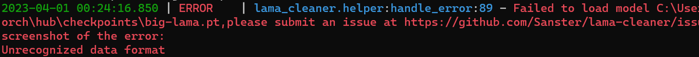
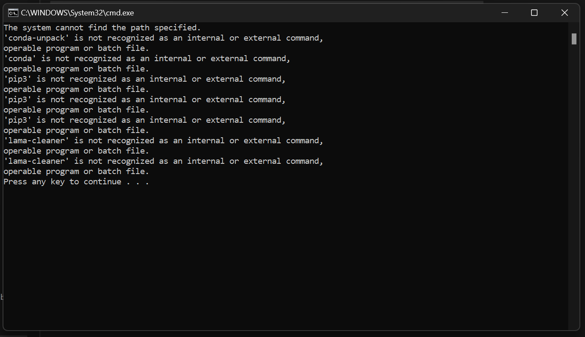

import { Callout } from "nextra-theme-docs"

# Q&A

## "Unrecognized data format" error



It may be a permission problem, please change the model save directory use `--model-dir` argument.

## How to update to the latest version?

- For installer: Rerun `win_config.bat` will install the newest version of IOPaint
- For pip: `pip install -U iopaint`

## Where are models downloaded?

By default, models will be downloaded to the user folder

- diffusion models: `~/.cache/huggingface/hub`. For Windows users, it's `C:\Users\your_name\.cache\huggingface\hub`
- lama and other erase models: `~/.cache/torch/hub/checkpoints`. For Windows users, it's `C:\Users\your_name\.cache\torch\hub\checkpoints`

## How to change the directory of model downloaded?

Add command line arg `--model-dir=xxxx`

## How to add command line args to the windows installer?

Double click `win_config.bat`, and you can config all command line args in web UI.

## How to change GPU device to use in windows installer?

Assume two GPUs, and you want to use second one, add `SET CUDA_VISIBLE_DEVICES=1` before IOPaint start in [win_start.bat](https://github.com/Sanster/IOPaint/blob/main/scripts/user_scripts/win_start.bat)

## windows installer error 1



This is caused by moving the directory after unpacking zip.

## windows installer error 2

Error message when run `win_config.bat`:

```bash
ValueError: When localhost is not accessible, a shareable link must be created. Please set share=True or check your
proxy settings to allow access to localhost.
```

Add `set no_proxy=localhost, 127.0.0.1, ::1` line to `win_config.bat` file

```bash
set no_proxy=localhost, 127.0.0.1, ::1
@call iopaint start-web-config --config-file %0\..\installer_config.json
```

## m1/m2 chip error: illegal hardware instruction

see: https://github.com/Sanster/IOPaint/issues/268

## How to completely uninstall IOPaint?

### Delete IOPaint program

- For windows installer: delete the unzipped folder
- For pip: `pip uninstall iopaint`

### Delete downloaded models:

By default IOPaint download model to `~/.cache/torch/hub/checkpoints/` / `~/.cache/huggingface/hub`
For Windows users, it's `C:\Users\your_name\.cache\torch\hub\checkpoints\` or `C:\Users\your_name\.cache\huggingface\hub`.

<Callout type="warning" emoji="⚠️">
  The default model cache directory may contain other models, so you should only
  delete the IOPaint related models.
</Callout>

If you used `--model-dir=xxxx` to change the model directory, you safely delete the directory you specified.

## Why do I get all black or green results when using diffusion models?

Some GPUs don't support half-precision floating point numbers (a known issue with 16xx cards),
a green or black screen may appear instead of the generated pictures.
This may be fixed by using the command line arguments `--no-half`

## How to avoid GPU memory OOM?

See [Memory](https://www.iopaint.com/memory)
