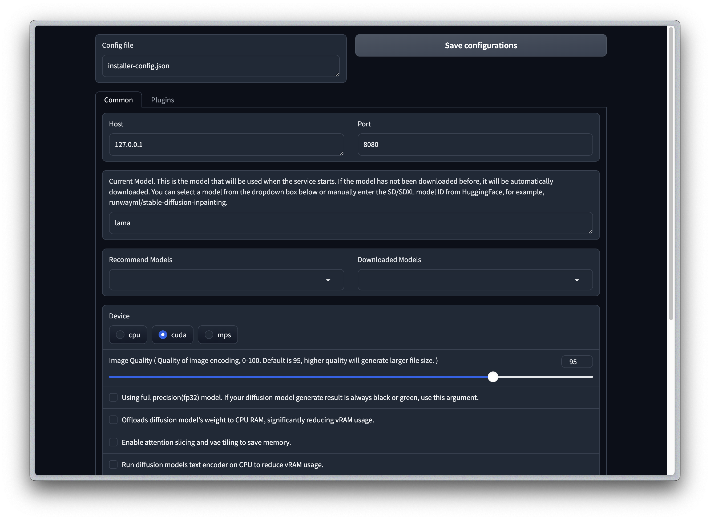

import { Steps } from 'nextra/components'

## Windows 1-Click Installer

You can always install IOPaint for free through pip, or purchase this 1-click installer for:

- Show your support ❤️ for IOPaint's future development(new feature/new models) and maintenance(bug fix), your donation is a great encouragement to me.
- Convenient environment setup, no need to worry about python or cuda
- All plugin dependencies have been installed.
- A web interface for server start configuration
- Easy to receive all future upgrades

<Steps>
### Download Installer

Get the installer at [here](https://panicbyte.lemonsqueezy.com/checkout/buy/8bb260b9-b650-4748-8dd8-b27f6fa0aa0e)

### Configure

Unzip the package, you will get a `win_config.bat` and a `win_start.bat` file.

Double click `win_config.bat`, it will take a few minutes to install all the dependencies, and open the web config page in your browser.
You can config all command line args in the web page, such as the path to download the model, whether to save vRAM(CPU Offload), etc.
Click the `Save configurations` button will save an `installer_config.json` file in the same directory.

### Start IOPaint

Double click `win_start.bat` to start the server, the first time it takes a few minutes to download the model.

</Steps>

