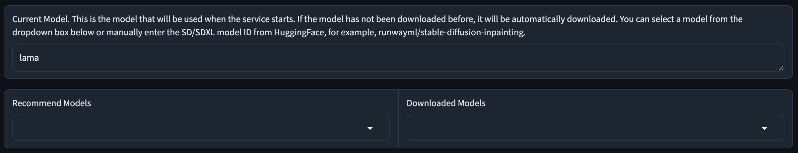

import { Steps } from 'nextra/components'

## Windows 1-Click Installer

You can always install IOPaint for free through pip, or purchase this 1-click installer for:

- Show your support ❤️ for IOPaint's future development(new feature/new models) and maintenance(bug fix), your donation is a great encouragement to me.
- Convenient environment setup, no need to worry about python or cuda
- All plugin dependencies have been installed.
- A web interface for server start configuration
- Easy to receive all future upgrades

<Steps>
### Download Installer

Get the installer at [here](https://panicbyte.lemonsqueezy.com/checkout/buy/8bb260b9-b650-4748-8dd8-b27f6fa0aa0e)

After a successful payment, you will receive an email containing a download link. 
If you never received the email, it might be due to an incorrect email address. Please open an issue [here](https://github.com/Sanster/iopaint-docs/issues) with your email to contact me.

### Install Dependencies

Unzip the package, you will get three bat files, double-click `win_setup.bat` to install dependencies.

- [win_setup.bat](https://github.com/Sanster/IOPaint/blob/main/scripts/user_scripts/win_setup.bat): Used for installing dependencies for the first time
- [win_config.bat](https://github.com/Sanster/IOPaint/blob/main/scripts/user_scripts/win_config.bat): Launches the gradio parameter configuration interface
- [win_update.bat](https://github.com/Sanster/IOPaint/blob/main/scripts/user_scripts/win_update.bat): To be executed when you need to update the iopaint version

### Configuration

Double click `win_config.bat`, it will open the web config page in your browser. 
You can config all command line args in the web config page, such as select server start model, model download directory, etc. 
Click the `Save configurations` button will save an `installer_config.json` file in the same directory.

### Model Select

You can enter the model name in "Current Model", including the models mentioned in [models](https://www.iopaint.com/models) 
or other Stable Diffusion/Stable Diffusion XL model id on HuggingFace, for example, "diffusionbee/fooocus_inpainting".

You can also choose from "Recommended Models", once selected, it will automatically populate in the "Current Model".

Model will be automatically downloaded the first time it is used. You can see all downloaded models in "Downloaded Models" dropdown.

IOPaint also supports loading local single file [ckpt/safetensors](https://www.iopaint.com/models#load-ckptsafetensors).

### Start IOPaint

Double click `win_start.bat` to start the server, the first time it takes a few minutes to download the model.

### Check FAQ

If you encounter any problems, please check the [FAQ](../frequently_asked_questions) first to see if there is an answer

</Steps>

