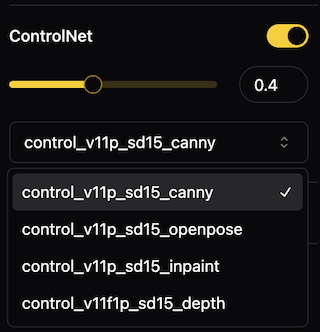

import YouTube from "../components/youtube"

# Models

IOPaint support many models out of the box. These models can be categorized into three groups.

## Erase Models

The following models can be used to remove any unwanted object, defect, watermarks, people.

- 🌟 [LaMa](models/erase/lama): Recommend
- 🌟 [MAT](models/erase/mat): Recommend
- 🌟 [MIGAN](models/erase/migan): Recommend. Minimal in size, requiring the least amount of resources.
- [LDM](models/erase/ldm)
- [ZITS](models/erase/zits)
- [FcF](models/erase/fcf)
- [Manga](models/erase/manga)

## Stable Diffusion Models

<YouTube youTubeId="VrV1Cixvc2Q" />

You can use any Stable Diffusion Inpainting(or normal) models from [Huggingface](https://huggingface.co/models?other=stable-diffusion) in IOPaint. 
Simply add `--model runwayml/stable-diffusion-inpainting` upon launching IOPaint to use the Stable Diffusion Models. 
Some other popular models include:

- [runwayml/stable-diffusion-inpainting](https://huggingface.co/runwayml/stable-diffusion-inpainting)
- [diffusers/stable-diffusion-xl-1.0-inpainting-0.1](https://huggingface.co/diffusers/stable-diffusion-xl-1.0-inpainting-0.1)
- [andregn/Realistic_Vision_V3.0-inpainting](https://huggingface.co/andregn/Realistic_Vision_V3.0-inpainting)
- [Lykon/dreamshaper-8-inpainting](https://huggingface.co/Lykon/dreamshaper-8-inpainting)
- [Sanster/anything-4.0-inpainting](https://huggingface.co/Sanster/anything-4.0-inpainting)

### Load ckpt/safetensors  

You can load the single file(ckpt/safetensors) Stable Diffusion models in IOPaint. 
Create two folders in the `model_dir` directory, `stable_diffusion` and `stable_diffusion_xl`.

Please refer to [Download Model](install/download_model) for instructions on how to set up `model_dir`.

```
- model_dir 
  |- stable_diffusion
  |- stable_diffusion_xl
```

### Cropper

You can use Cropper to perform inpainting operations on only a specific area.

<YouTube youTubeId="NSAN3TzfhaI" />


### Expander

You can use Expander to enlarge the size of the image(outpaining).

Outpainting using [PowerPaint](./models/diffusion/powerpaint)
<YouTube youTubeId="kIXCtoSZ0a0" />
 

### ControlNet

You may activate the usage of ControlNet within the web interface and select which ControlNet model to utilize.



### LCM LoRA

https://huggingface.co/docs/diffusers/main/en/using-diffusers/inference_with_lcm_lora

Enable quality image generation in typically 2-8 steps. Suggest disabling guidance_scale by setting it to 0. 
You can also try values between 1.0 and 2.0. When LCM Lora is enabled, LCMSampler will be used automatically.

### Mask Blur

Blur the mask before processing, make the generated inpainting boundaries appear more natural.

### Match Histograms

Match the inpainting result histogram to the source image histogram, it is possible to enhance the naturalness of the generated result.


## Other Diffusion Models

- [PowerPaint](models/diffusion/powerpaint): With the concept of "learnable task prompts", PowerPaint can achieve specific tasks more effectively. These tasks include text-guided, shape-guided, object-remove, and outpainting.
- [AnyText](models/diffusion/anytext): Generate text on images that aligns with the style of the image and the prompt. 
- [Paint by Example](models/diffusion/paint_by_example): Use an example image to guide the model to generate similar content on the image.
- [InstructPix2Pix](models/diffusion/instruct_pix2pix): Use a text instruction to edit the picture.
- [Kandinsky](models/diffusion/kandinsky): Kandinsky inherits best practices from Dall-E 2 and Latent diffusion while introducing some new ideas.
