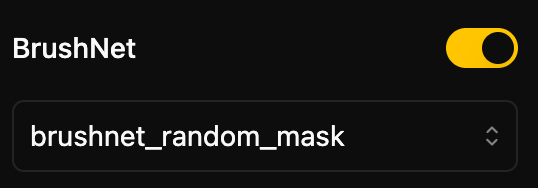

import { Callout } from "nextra-theme-docs"

# BrushNet: A Plug-and-Play Image Inpainting Model with Decomposed Dual-Branch Diffusion

GitHub: https://github.com/TencentARC/BrushNet

Brushnet can turn any sd1.5 model into an inpainting model. 
When you use any SD1.5 base model(e.g: `runwayml/stable-diffusion-v1-5`), the option for brushnet will appear in the sidebar. 
There are two models to choose from: `brushnet_segmentation_mask` and `brushnet_random_mask`.
Using `brushnet_segmentation_mask` means that the final inpainting result will maintain consistency with the mask shape, 
while `brushnet_random_mask` provides a more general ckpt for random mask shapes.

  

<Callout type="info" emoji="ℹ️️">
    Some configurations (such as ControlNet, LCM LoRA...) cannot work with BrushNet, and they will be automatically disabled when you enable BrushNet.
</Callout>
