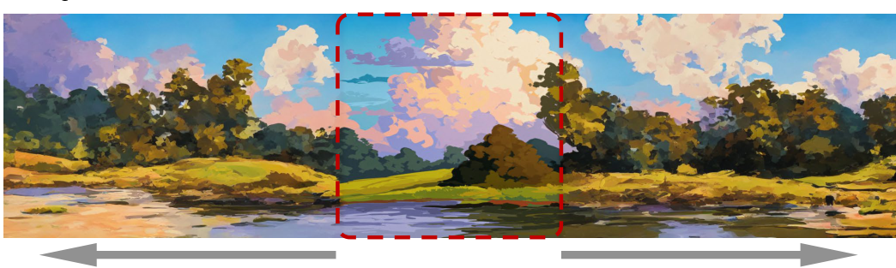

# PowerPaint: A Task is Worth One Word: Learning with Task Prompts for High-Quality Versatile Image Inpainting

- `--model Sanster/PowerPaint-V1-stable-diffusion-inpainting`
- GitHub: https: //github.com/zhuang2002/PowerPaint
- Paper: https: //arxiv.org/abs/2312.03594

PowerPaint introduces the concept of "learnable task prompts" to guide the model in achieving specific tasks more effectively. 
These tasks include `text-guided`, `shape-guided`, `object-remove`, and `outpainting`.

In IOPaint, you can select specific tasks through the dropdown menu on the right. 
The outpainting task is automatically utilized when using Expander.

### text-guided
During the training of PowerPaint, the inpainting model utilizes the bounding box of the object as the mask for inpainting.

### shape-guided

### object-remove

### outpainting

